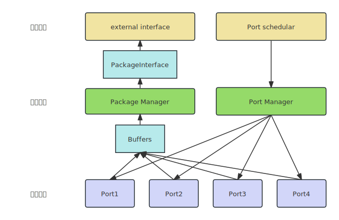
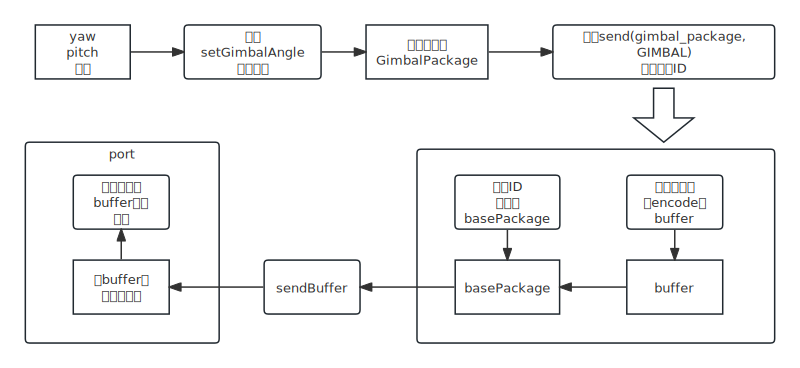
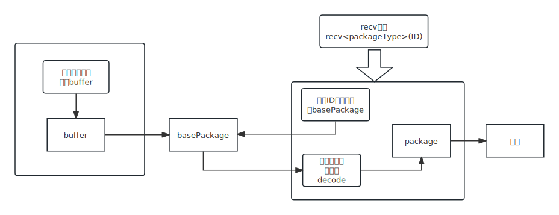

# Transport
## 类列表
### 基础类
1. BasePackage
   1. 数据结构
      1. BufferWithTime队列
      2. function函数指针，用于向外发包

2. PackageInterFace
   1. 数据结构：无

3. Port
   1. 数据结构
      1. port name 名称
      2. map->(id, base package ptr)收发包映射表
      3. package manager 包管理器
      4. port status 状态描述结构
      5. buffer 收包队列

4. BaseROSInterface
   1. 数据结构：基本ros通信得东西


### 功能类
1. CanPort
   1. 数据结构：继承Port，无额外特殊结构
2. PackageManager
   1. 数据结构
      1. map->(id, base package ptr)收发包映射表
      2. vector->(Port ID table {port name, id list} ) 每个端口名和其负责收发的包
3. PortController
   1. 数据结构
      1. map -> (port name, port ptr) 端口名和对应实例化都指针
      2. map -> (port name, port status) 端口名和对应状态指针
      3. map -> (port name, int) 端口名和其所在的组
4. PortGroup
   1. 数据结构
      1. map-> (port name, port ptr) 端口名和对应的实例化指针

## 改进

1. PortGroup 整合到PortController里，统一叫PortManager，给PackageManager提供绑定回调函数绑定服务
2. PortManager记录是否开启Controller
3. PortManager只负责更新Package的回调函数，PackageManager不负责管理底层哪个Package对应到哪个Port了，这个PortManager管
4. 检测到崩溃，调度方法：依次从损坏的port中获取unorder_map，申请一个新的相同pkg，绑定函数放到PackageManager里，另原来的Port不崩溃。
5. 初始化时，哪个Pacakge对应哪个Port由PortManager读取
6. 首先申请PackageManager，然后申请PortManager，然后portmanager->register(packagemanager),对packagemanager里都包依次迭代，去找对应哪个port，依次注册包，如果没找到默认can0

## 改进

0. Port：增加线程执行一次read和write都接口，线程函数不再暴露在外，usleep改进和
1. CanPort
   1. 数据结构：继承Port，无额外特殊结构，（接口不可用后，改进usleep时间，线程不再崩溃，设置定时检测函数）
2. PackageManager
   1. 数据结构
      1. map->(id, base package ptr)收发包映射表
      2. vector->(Port ID table {port name, id list} ) 每个端口名和其负责收发的包{这个转移到portManager里}
3. PortController
   1. 数据结构
      1. map -> (port name, port ptr) 端口名和对应实例化都指针
      2. map -> (port name, port status) 端口名和对应状态指针（可以不要了）
      3. map -> (port name, int) 端口名和其所在的组 // 这个不要了
      4. 
4. PortGroup
   1. 数据结构
      1. map-> (port name, port ptr) 端口名和对应的实例化指针（不要了）


# 改第三版
1. 发包路径：main->call control.sendFunc -> packageManager.send(Type,CANID) {-> PackageType.encode } -> BasePackage.sendBuffer { writeBuffer.push_pack } 
2. 收包路径：main->call control.recvFunc -> packageManager.recv {->BasePackage.readBuffer, PackageType.decode }


# 文档

## 整体介绍

transport包主要为替代之前的port和control制作。目前分三层，五个功能模块。



五个功能模块分别为：
	Port：端口实现
	PortManager：端口管理，主要负责统一创建端口，辅助包和端口绑定
	PortScheduler：端口调度，主要负责检测端口是否可用，将不可用端口的负载迁移到可用端口
	PackageManager：包管理器，主要负责创建、管理包，提供收发接口
	external-interface：外部接口，分为纯cpp和ros接口两类，负责提供收发包的函数接口。

四个基础类：
	Port：接口父类，提供统一对外接口
	Buffer：二进制数据
	BasePackage：一个Buffer队列，提供收发Buffer的接口
	PackageInterFace：父类模板类，提供一套对包进行编解码的基础模板
	BaseROSInterface：制作ROS external interface时的基础类，提供一套简化ROS通信写法的机制

## 收发包原理

1. 首先需要**package类，其中至少需要包含encode/decode函数用于编解码。其中encode用于将原始数据转为buffer，decode用于将buffer转为原始数据。之后该package类可以自定义各种接口用于设置数据。
2. 发包时，首先向package中写入原始数据，之后调用package_manager的send函数。send函数是一个模板函数，根据输入的package类型调用对应的编码函数，并根据输入的ID号找到对应的BasePackage，调用sendbuffer函数将编码好的buffer放入BasePackage中。BasePackage的sendbuffer函数包装了一个函数指针，用于将对应buffer放入port的发送队列，最后port读取发送队列将buffer发出。
   
3. 收包时，port首先根据id将收到的buffer放入对应的basePackage。当外界调用recv函数时，首先根据ID获得包的basePackage，然后根据模板类型调用decode解码，recv将返回解码后的package。
   
4. 使用外部接口封装send/recv函数。

## PackageManager原理

​		PackageManager类中的核心是一个map，记录了每个ID到basePackage的对应关系。每个port中含有一个该对应关系的子集(每个port只含有其需要收发的包的对应关系)。可以认为PackageManager是一个抽象的中间层，屏蔽了下层编解码和收发包的操作，对上层提供了统一的收发接口(send/recv函数)。

## 使用方法

1. config使用方法：
   1. port_list：在此处列出要创建那些端口，如can1、can2.....
   2. id_list：在此处列出每个端口负责收发的id，**如果没有列出，当收到或需要发送对应包时会发生崩溃**。
   3. schedule_group：调度组，同一个调度组内的端口是可以互相替换的，当一个端口崩溃时，任务可以迁移到同组中的另一个端口上。
2. 当你的通信协议里新增加了一个包
   1. 首先修改config.yaml，向id_list中添加包id。
   2. 前往Protocal.hpp，向CAN_ID中添加对应的枚举和value，该value应该和id_list中的保持一致。
   3. 在pkg文件夹中新建文件，构造一个新类，并重载encode、decode、toString函数(按需重载，比如该包只用于发送，则不写decode也可)，接着可以写一些函数用于设置数据。
   4. 在external-interface文件夹中，可以选择在原有接口中新增接口，也可以创建新接口类，制作新增包的对外接口。
3. 当原有的包有修改时：
   1. 改了包id：修改config.yaml和Protocal.hpp中的CAN_ID即可。
   2. 改了包的定义方式：根据需要修改encode decode等函数。
   3. 改了对外接口：只改external-interface接口即可。

## 新增pkg

1. 首先应该使用`#define`或`#pragma once`防止重复引用

2. 其次include`PackageInterface.hpp`，其中包含了一个基类和一些工具函数

3. 可选：定义一个解析buffer的结构体，命名一般以P开头，咋用看代码
   ```
   #pragma pack(1)	// 定义对齐方式：按1字节对齐
   struct PGimbal
   {
       uint8_t info : 8;				// 使用':'的语法：设置每个变量的数据位大小
       uint16_t yaw_speed : 12;		// 该结构体的格式应该和你的buffer定义一致
       uint16_t pitch_speed : 12;		// 从而先将buffer按位解析，减轻工作量
       uint16_t yaw_angle : 16;
       uint16_t pitch_angle : 16;
   
       TRANSFORM_FUNC(PGimbal)	// 该宏定义了一系列后续可能需要使用的函数
   };
   #pragma pack() // 结束自定义对齐方式，使用默认对齐（一般是4字节对齐，不确定可以写demo测试一下）
   ```

4. 定义package类，使用`**Package`命名格式，使用`public`继承`PackageInterface`类。
   **必须要写的**：

   1. 构造函数，一般我还自定义了拷贝构造函数和=重载，使用默认的也行。
   2. encode和decode函数，发包可以不重载decode，收包可以不重载encode，PackageInterface有默认的。`PackageInterface.hpp`里有一些用于数据变换的函数，可以减轻一定工作量。如果包结构比较复杂，可以定义步骤3中的结构体，降低工作量。

   **可以不写的**: toString，这个在log和debug中用，不写也没事，无非是找问题时费点劲罢了

   **其他部分自由发挥**

   `ps: IENUM和UENUM可以视为常量，不会占用内存空间，有作用域，咋用可以参考代码`

   

## 定义external-interface

1. 定义cxxInterface，照着代码自己添
2. 定义ROS Interface：
   1. 首先是BaseROSInterface，其中对ROS收发机制做了简化`addPublisher/addSubscription`。如果想自定义`callback_group`等，可以看BaseROSInterface的构造函数，自己对变量重新赋值。
   2. 此外我们还定义了BaseParam结构体，用于在不同类之间共享param
   3. 再此外`addPublisher`函数要求回调函数包含一个参数`int index`，用于索引使用队列中的哪个publisher，同时在调用`addPublisher`时，在回调函数参数里要依次设置`0, 1, 2, ...`(到底怎么用看代码)
   4. 还有和一般ros2编程区别就是，不是使用`this`指针而是使用类成员`m_node`调用ros2node的函数。
3. 你如果不喜欢这种风格的ROS接口，也可以自由发挥，无所谓。
4. 此外，在使用ROS的部分，记得加上`__USE_ROS__`宏。

## 乱七八糟的东西

1. 编译选项有好几个，还做了个fake_port，具体都是啥都有啥自己看代码，也不复杂。
2. src里那个Transport.cpp才是真正的main函数
3. 所有代码都是在头文件里写的，基本没有cpp，所以重复编译时费点劲，因为不会触发增量编译。编译时间这块我也搞不清为啥这么长时间，老版的通信编译起来也特别慢，怀疑是ros的问题。
4. 代码里使用了很多constexpr，主要是想尽量编译时优化一下，但其实实际用处不大，这玩意顶多优化几条汇编，不如好好优化一下代码逻辑，收益更高。
5. 编译选项里我开了avx和-O3，希望能带来些优化。当存在大规模数据拷贝或者复杂矩阵计算时，真的可以考虑一下SIMD，比如用openblas或者手搓，快的一批。
6. 一根小水管的发包速度是有限的，当发包队列里堆积了一些包时（不堆积最好，超过2个就开始有可观的延迟了)会导致发包延迟。
7. portSchedule可以选择不开，不影响的，只是当一个U转can寄了的时候，任务无法迁移到另一个U转can。

## TODO

1. 更改Basepackage和PackageManager，使其支持一次收发多个buffer（优先级中）
2. 想想能不能将现在的buffer拷贝换成指针，降低拷贝开销（优先级低）
3. 增加log机制和异常机制，优化报错（优先级高）
4. 将哨兵接口实现完全（优先级中）